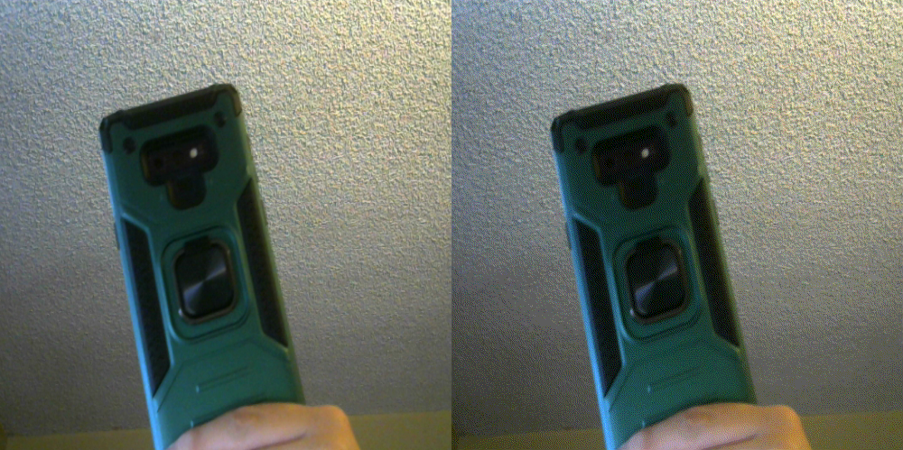
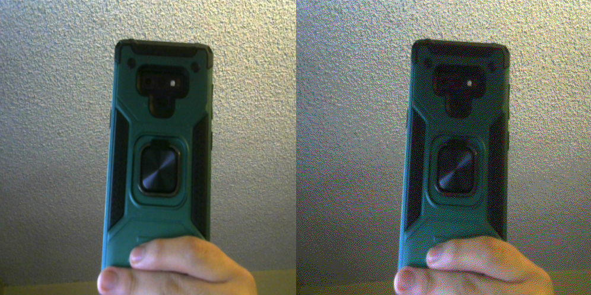
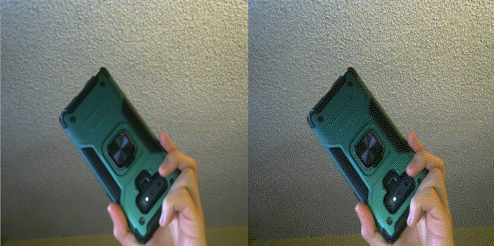

The project was inspired by this video by The Coding Train:

Coding Challenge #90: Floyd-Steinberg Dithering

https://youtu.be/0L2n8Tg2FwI

The pseudocode for the algorithm I used is from:

https://en.wikipedia.org/wiki/Floyd%E2%80%93Steinberg_dithering

You must have a webcam connect to your computer to work.

Images:

Color Factor 8:

Color Factor 4:

Color Factor 1:

